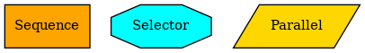
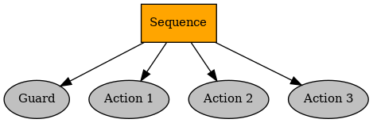
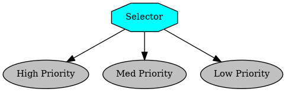
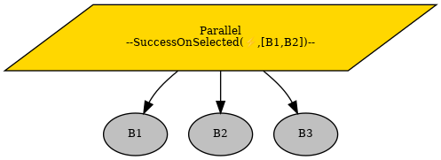
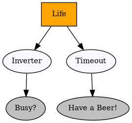

> [출처: py-tree.readthedocs.io](https://py-trees.readthedocs.io/en/devel/index.html)

## 0. 목차
    1. 용어
    2. 구성 요소
        2.1. Behavior
        2.2. Composite
                Sequence
                Selector
                Paraller
        2.3. Decorator
        2.4. Blackboard

## 1. 용어

- ___guard___
    - action node(child node) 혹은 composite node ** ___이전에 실행 여부를 결정___ ** 하는 독립적인 conditionally logical node
    - 추가적인 속성이나 데코레이터 형태로 붙어서, action node의 tick 자체를 ** ___감시/사전 차단___ ** 하는 역할
    - 때문에 백그라운드에서 실행 조건을 지속적으로 감시.

- ___tick___
    - 주기적 신호 혹은 다음 행동을 결정하도록 하는 __명령__ 혹은 __트리거__   
    - tick은 최상위 노드에서 시작하여 하위 노드로 전달 된다.  
    - tick 신호를 받은 노드는 자신의 행위를 실행.


- ___blackboard___: events, notifications, incoming data를 caching 하는 위치.  
behavior tree 밖에서 blackboard는 data gathering을 병령적으로 수행하고 있음. 읽고, 쓰는 데이터는 동기적으로 이루어짐


## 2. 구성 요소

### 2.1. Behavior

- ___action___  
    - behavior node의 종류 중 하나로 action node라고도 함. (나머지 하나는 action)  
    - ~ 하자. (예: 걷기, 공겨가기, 문 열기, 연결하기)

- ___check(혹은 condition)___
    - behavior node 종류 중 나머지 하나로 check node라고도 함.   
    - 환경이나 내부 변수의 ** ___현재 상태의 즉각적 평가___  **    
    - 이후 설명할 status의 SUCCES와 FAILURE 만 반환하게 된다.  
    - ~ 한가? (예: 체력이 50% 미만인가?, 장애물이 있는가?, 시야에 적이 있나?)  
    - 주로 sequenc나 selector 같은 composite node의 children 중 시작에 위치하고, 후속 action의 실행 여부를 결정한다.

- ___status___:   
    - FAILURE: behavior이  ***check == fail*** 혹은 ***action의 결과가 실패***    
    - INVALID: behavior가 initialized 안되거나 inactive 상태이거나 현재 tick 되지 않았을때, 혹은 초기 상태   
    - RUNNING: behavior가 실행중일때, 즉 결과를 아직 모르는 상태.  
    - SUCCESS: behavior이  ***check == pass*** 혹은 ***action의 결과가 성공***      
  
- ___py_trees code___
    ``` python
    class Behaviour:
        # Users should override
        def setup(self, **kwargs: typing.Any) -> None: 
        def initialise(self) -> None: 
        def terminate(self, new_status: common.Status) -> None:
        def update(self) -> common.Status:
        def shutdown(self) -> None:
    ```

    - setup() 함수는 생성자에서 하지 않는 모든 일회성 리소스를 초기화. (예: 하드웨어 연결.)
    - initialise() 함수는 RUNNING 상태 아닐때만 kicks(실행?) 
    - initialise() 함수는 behaviour가 즉각적으로 실행 하는 (반복적으로) 것들을 준비. (예: 변수 초기화, 타이머 시작, )
    - parent(= composite)의 tick() 함수는 initialise(), stop(), terminate() 함수 호출 시점 결정.
    - parent(= composite)의 tick() 함수는 항상 update() 함수를 호출.
    - update() 함수는 behaviour의 status를 결정한


### 2.2. Composite



- 역할  
    - behavior의 경로를 결정하는 역할. 즉, *실행 방식* 을 결정.
    - children 을 관리(?, 관리의 정의가 뭐지).
    - children의 결과 값을 반환.
    - Composite 자체로는 어떤 행위를 하진 않음.

- ___py_trees code___
    ``` python
    class Composite:
        def tick(self) -> typing.Iterator[behaviour.Behaviour]:
        def stop(self, new_status: common.Status = common.Status.INVALID) -> None:
    ```

> ### ___Sequence___  
>  

- 동작 방식 (== AND 로직)
    - 왼쪽에서 오른쪽으로 순서대로 children 을 tick.
    - 자식이 FAILURE을 반환하면 그 즉시 parent로 FAILURE 반환.
    - 모든 children 성공 했을때, 비로소 parent로 SUCCESS 반환.
- 유의 사항
    - 항상 왼쪽 node를 check node로 배치.
    - child node가 RUNNING을 반환하면 그 즉시 parent로 RUNNING 반환.
    - 다음 tick이 들어왔을때, 이전 RUNNING을 반환한 child node가 다시 실행. (re-entry policy, memory)


> ### Selector
> 

- 동작 방식 (== OR 로직)
    - 우선순위가 높은(혹은 왼쪽) 순서대로 실행. 
    - 어떤 child가 SUCCESS를 반환하면, 즉시 실행 중단하고 parent로 SUCCESS 반환.
    - 모든 children이 FAILURE 반환하면, parent로 FAILURE 반환.
       
- 유의 사항
    - 가장 중요하고 쉽고 긴급한 action 혹은 check를 가장 높은 우선순위로 할당.
    - 자식이 RUNNING을 반환하면 그 즉시 parent로 RUNNING 반환.
    - 다음 tick이 들어왔을때, 이전 RUNNING을 반환한 child node가 다시 실행. (re-entry policy, memory)
    - 앞에 위치하는 check node는 pass 하면 SUCCESS를 반환하도록 설계.

> ### Parallel
> 

- 동장 방식 (concurrancy)
    - Success Policy
        - ___Policy M___: M개의 children이 성공하면, parallel node 가 SUCCESS
        - ___Policy All___: 모든 children이 성공하면, parallel node 가 SUCCESS
    - Failure Policy
        - ___Policy M___: M개의 children이 실패해도, parallel node 가 FAILURE
        - ___Policy All___: 모든 children이 실패해야만, parallel node 가 FAILURE
- 유의 사항
    - 보통의 경우, Success on M(1개만 성공해도 전체 성공)과 Failure on All(모두 실패시 전체 실패) 를 사용.
    - 예측이 어려우므로 조심해서 사용.
    - 동일한 리소스(blackboard)를 수정을 조심.
    - 반환이 결정되면, children node들을 모두 terminate 시켜야함.
- py_tree 프레임워크의 정책
    - SuccessOnAll, SuccessOnOne, SucceessOnSelected

### 2.3. Decorator
> 

- 동작 방식
    - 부수 적인 역할(동작 방식 변경, 반환 값 변경)을 한다.
    - 단 하나의 child node 만 가진다.
    - child node의 실행 전/후 에 개입한다.
    - child node 상태를 그 대로 갖는다.
- 동장 종류
    - Condition, Count, EternalGuard, ForEach, Inverter, OneShot, Repeat, Retry, StatusToBlackboard, Timeout
    - FailureIsRunning, FailureIsSuccess, RunningIsFailure, RunningIsSuccess, SuccessIsFauilure, SuccessIsRunning
- 유의 사항
    - 과도한 사용 금지.


### 2.4. Blackboard
- 필수 요소는 아님.
- behavior node 간의 데이터 쉐어링을 위해 사용.
- key-value 로 전역적으로 접근하는것이 가장 단순함.